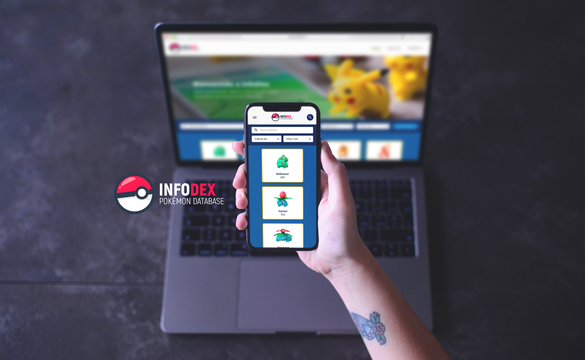
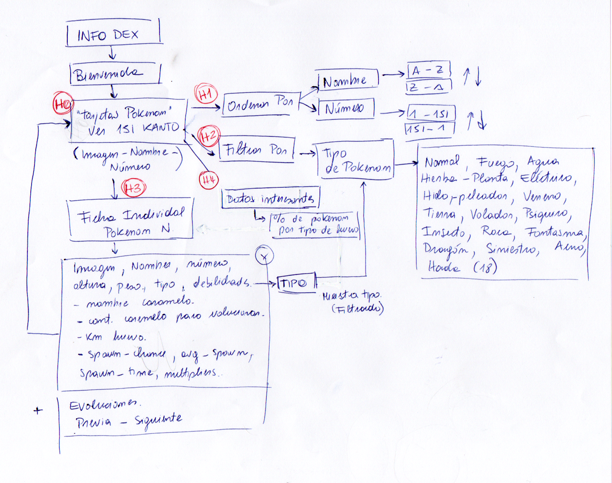
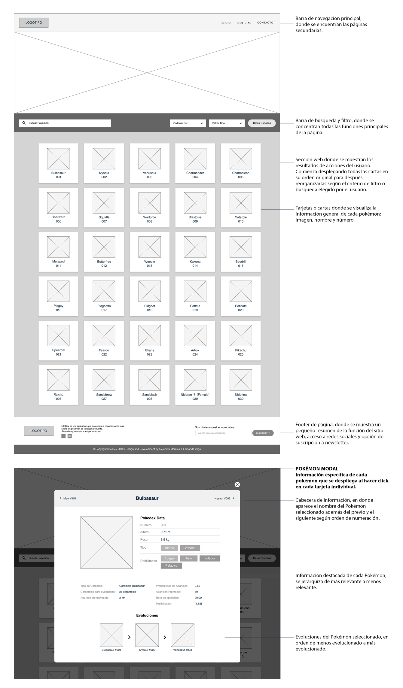
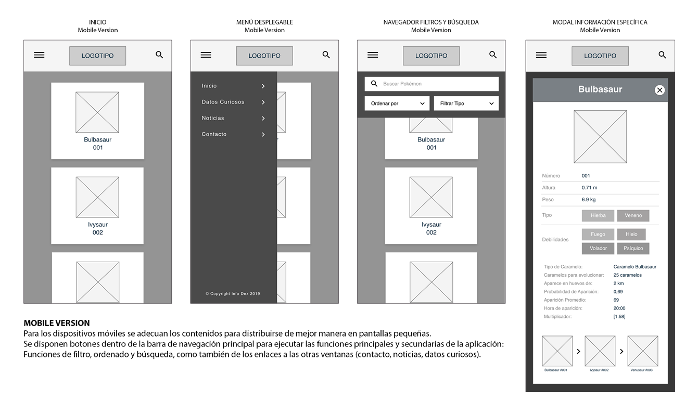
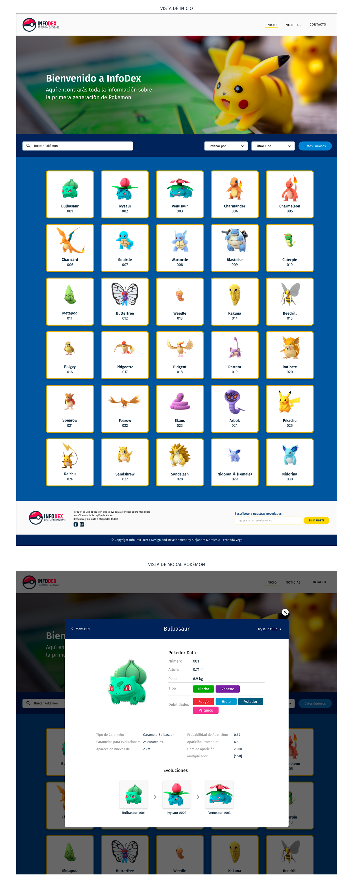
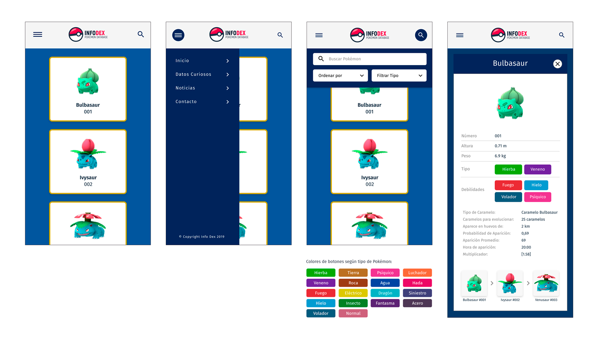
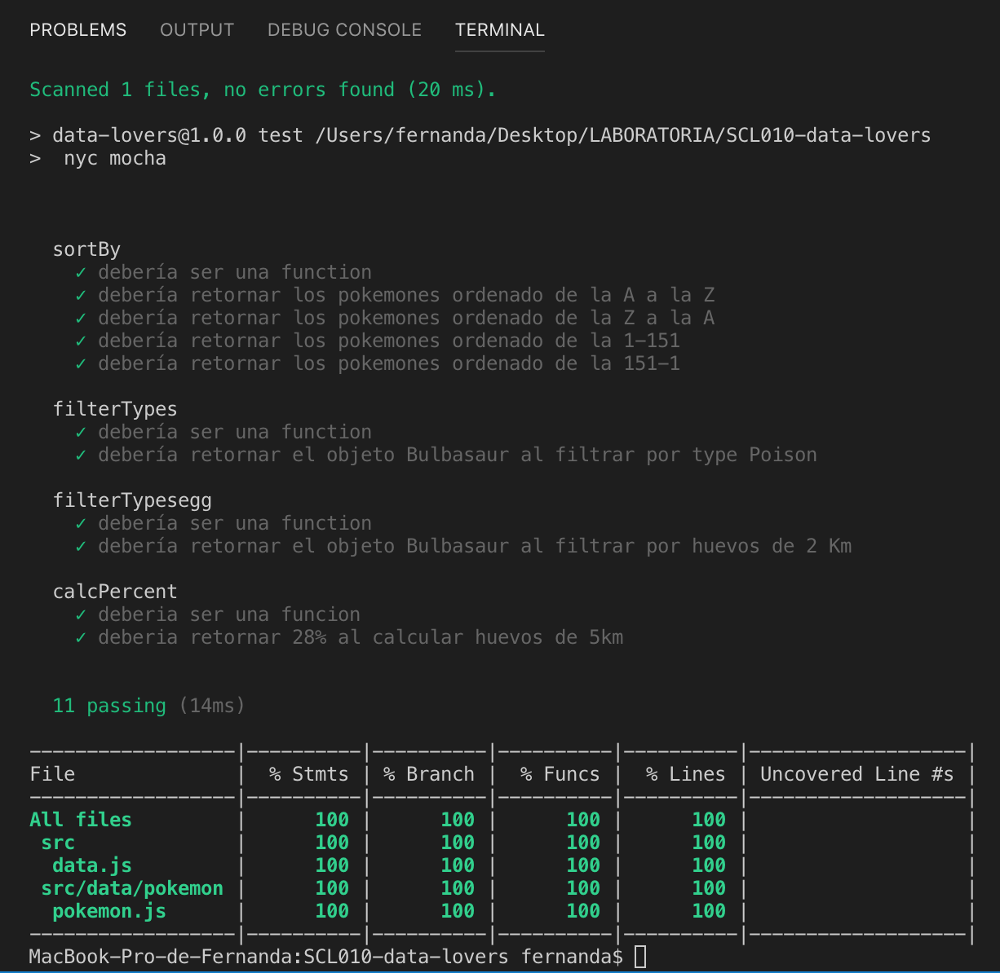

# InfoDex 

 

“InfoDex” es una aplicación web que les brinda a los usuarios información relevante sobre los pokémon de la región Kanto para poder ayudarlos a conocer más sobre cada uno de ellos y así mejorar su nivel y experiencia de juego. La aplicación está dirigida hacia jugadores básicos e intermedios, es decir, jugadores que recién comienzan en el mundo de Pokémon Go! O tienen conocimientos poco profundos sobre el por lo que la información disponible se adecúa a sus necesidades, requerimientos y curiosidades, para así convertirse en jugadores avanzados en Pokémon Go”.

## Tabla de Contenidos 

[1. Contexto](##1-Contexto)

[2. Metodología UX](##2-Metodología-UX)

[3.Pruebas Unitarias](##3-Pruebas-Unitarias)

[4. Herramientas](##4-Herramientas)

[5. Desarrolladoras web](##5-Desarrolladoras-web)

## 1. Contexto 
Pokémon GO es un videojuego de realidad aumentada basado en la localización del usuario desarrollado por Niantic, Inc. para dispositivos iOS y Android. Es un videojuego gratuito pero contiene microtransacciones. El juego consiste en buscar y capturar personajes de la saga Pokémon escondidos en ubicaciones del mundo real y luchar con ellos, lo que implica desplazarse físicamente por las calles de la ciudad para progresar. 

El juego fue lanzado oficialmente por en Estados Unidos, Australia y Nueva Zelanda el 6 de julio de 2016 y hasta el día de hoy a alcanzado un número aproximado de 120 millones de usuarios activos y un total de 550 millones de descargas en las tiendas de AppStore y Google Play

• Para conocer más info sobre el juego [haz click aquí](https://es.wikipedia.org/wiki/Pok%C3%A9mon_GO)

• Para conocer más info sobre Niantic, Inc [haz click aquí](https://nianticlabs.com/es/)

• Para descargar el juego o ver sus actualizaciones [haz click aquí](https://pokemongolive.com/es/)

• Para acceder a demo de app [haz click aquí](https://alejandramoralesb.github.io/SCL010-data-lovers/src/index.html)

###1.1. Usuario

**Nivel Jugador:** Básico-intermedio de Pokémon Go!

Una persona que tiene conocimientos básicos sobre el juego, o que lleva poco tiempo jugando; hombre o mujer dentro en rango etario amplio que se inicia desde los 10 años en adelante sin límite de edad.

Este usuario busca información general pero detallada de los pokémon de la región de Kanto para poder desenvolverse de mejor manera en el juego e ir aumentado tanto su nivel de personaje como su nivel de experiencia en el juego.

El jugador básico-intermedio recién se está interiorizando dentro del mundo de Pokémon Go o lleva poco tiempo interactuando con el, por lo que necesita tener acceso a información general pero precisa de los personajes del juego; como el usuario  trata principalmente de encontrar y capturar pokémon, entrenarlos y hacerlos pelear entre sí, se decide jerarquizar la data desde lo más general a lo más específico con fin de facilitar la búsqueda de información para un usuario principiante como también otorgarle la oportunidad al usuario que necesita información detallada a internarse en secciones más específicas de la app.

### 1.2. Problemática del Usuario
El usuario como jugado básico-intermedio necesita tener **acceso rápido, claro y organizado a información de los pokémon de la región de Kanto** disponibles en el juego Pokémon Go, tanto a manera general como individual, ya que para poder aumentar de nivel o lograr objetivos dentro del juego es necesario conocer algunas cualidades básicas de los personajes (por ejemplo qué tipo son y que debilidades tienen según tipo). Teniendo la información disponible los jugadores pueden lograr conocer cada uno de los pokémon, sus habilidades, debilidades, cómo evolucionarlos, cómo entrenarlos y cuándo es buen momento para atraparlos para convertirse en un mejor jugador y aumentar de nivel de personaje.

###1.3. Objetivos de la app
- Entregar información ordenada y clara a los usuarios del juego Pokémon Go!
- Mostrar de manera global todos los pokémon disponibles en la región de Kanto.
- Mostrar información más detallada sobre cada uno de los Pokémon y sus características básicas.
- Dar la opción al usuario de ordenar y organizar la información de los Pokémon por parámetros como nombre o número
- Dar la opción al usuario de filtrar la información según su interés
- Entregar información adicional o de interés al usuario como estadísticas, porcentajes, entre otros.

##2. Metodología UX

### 2.1. Encuesta
En primera instancia se redacta y ejecuta una encuesta con el Formulario de Google Forms, para definir los parámetros generales de la aplicación, por ejemplo a qué usuario nos vamos a dirigir, cuáles son sus necesidades e intereses sobre y con el juego, como también para obtener claridad sobre cuál es la información más relevante a la que dichos usuarios necesitarían acceso.

Con ésta información se plantea la jerarquización de la data y de sus funcionalidades para poder acomodarla dentro del flujo de la aplicación junto con parámetros de usabilidad (web y móvil) como también de diseño de interface (UI).

####2.1.1. Alcance de la encuesta:
La encuesta alcanzó un total de 36 respuestas en un día y se puede encontrar haciendo click [encuesta :memo:](https://docs.google.com/forms/d/e/1FAIpQLSdq6t9zDqskVMIGWNljzjxb7Z_z6tsroUHL9FXxoBTI1ueA7w/viewform)

#### 2.1.2. Conclusiones de la encuesta:
A partir de los resultados pudimos obtener y definir:

- Nuestro usuario target: jugador básico-intermedio de Pokémon Go!
- Información relevante para un primer orden: nombre, imagen y número
- Información relevante para filtrar: tipo de pokémon.
- Información relevante para los usuarios (cálculo agregado)

### 2.2. Historias de Usuario
Posterior a la encuesta, y a un estudio más profundo sobre nuestro usuario, se desarrollan las Historias de Usuario, las cuales definen las acciones y funciones que nuestro usuario necesita y quiere realizar dentro de la app para lograr sus objetivos como jugador , la planificación se realizó mediante  un trabajo colaborativo en [Trello.](https://alejandramoralesb.github.io/SCL010-data-lovers/src/index.html)

- **Historia de usuario 0:** “Yo como jugador básico-intermedio de Pokémon Go!, quiero poder ver todos pokémon de la región de Kanto para así poder conocerlos o identificar los que me falta”

➡ **Criterios de aceptación**
Creamos en la App Web un contenedor en la pantalla principal con todos los pokémon para que el usuario pueda reconocerlos, identificarlos  y acceder a su información inmediatamente.

- **Historia de usuario 1:** “Yo como jugador básico-intermedio de Pokémon Go!, quiero ordenar los Pokémon por nombre y por número para así poder encontrarlos fácilmente”

➡ Criterios de aceptación
Creamos en la App Web un selector en la pantalla, con 4 opciones, ordenando por nombres, números y viceversa, esto permite encontrarlos rápidamente según opción que se escoja.

- **Historia de usuario 2:** “Yo como jugador básico-intermedio de Pokémon Go!, quiero poder filtrar los Pokémon por su tipo para poder ver solo aquellos de mi tipo favorito”

➡ Criterios de aceptación
Creamos en la App Web un selector en la pantalla, con los tipos de pokemones, especificando los 15 tipos que existen en la primera generación.

- **Historia de usuario 3:** “Yo como jugador básico-intermedio de Pokémon Go!, quiero poder buscar un pokémon, para encontrarlo más fácil y obtener su información.

➡ Criterios de aceptación
Creamos en la App Web un selector en la pantalla, para buscar un pokémon en específico, imprimiendo en pantalla el pokémon buscado.

- **Historia de Usuario 4:** “Yo como jugador básico-intermedio de Pokémon Go!, quiero conocer el porcentaje de pokémon por tipo de huevos para saber en qué huevo puedo conseguir más varidad de pokemones"

➡ Criterios de aceptación
La plataforma debe tener un contenedor en la pantalla principal con todos los pokémon para que el usuario pueda reconocerlos y acceder a su información inmediatamente.

### 2.3. Diagrama de Flujo 
A partir de las historias de usuario se define el flujo básico de la aplicación:

### 2.4. Prototipo de Baja Fidelidad 
 
#### Sketch 
Nuestro primer objetivo fue distribuir cada elemento de la App Web , de acuerdo a lo visto en las historias de usuario.

El sketch fue presentado a distintos grupos de trabajo en Laboratorio  y conocidos para obtener feed-back, los cuales la mayoría comento que  es un prototipo de fácil de uso y amigable.

#### Wireframe
Desarrollo formal de página web, en términos de estructura, contenidos y diagramación. Se desarrolla Wireframe para versión web y para versión mobile.

### 2.5 Prototipo de Alta Fidelidad
Se generó observaciones de usabilidad y que fueron más relacionadas al diseño.

#### Colores 

[Colores en Material.io](https://material.io/tools/color/#!/?view.left=1&view.right=0&primary.color=01579B&secondary.color=FFD600&primary.text.color=ffffff)

#### Tipografía
La tipografía elegida es Fira Sans

#### Logotipo

#### Vistas

###2.6. Testeos de Usabilidad
Se testea con 5 personas presentando la página Info Dex, pidiéndoles que puedan: Visualizar la data, ordenar, filtrar y Buscar. 

Al finalizarla el test se les pregunta:
- ¿Sabes de que trata la página?
- ¿La utilizarías para jugar Pokémon Go?
- ¿Agregarías Algo?

**Usuario 1:**
Sebastián, 27 años, jugador Básico de Pokémon Go, trabajador.
Menciono que la página se trataba sobre Pokémon , No tuvo problemas para resolver lo solicitado , expreso que la información está clara y de fácil acceso , menciono que podía saber claramente los pokemones de la primera generación y la utilizaría , pero agregaría información específica en cada uno de las cartas y verla de forma aumentada.

**Usuario 2:**
Camila, 18 años, No jugadora de Pokémon Go, Estudiante.
Menciono que la página era de pokémon, consulto nuevamente las instrucciones, pero las pudo resolver. En la parte buscar sugirió colocar un botón para ejecutar, ya que no le quedaba muy claro, encontró que era un diseño atractivo que le servía para conocer a los pokemones si quisiera jugar, agregaría más interacción como videos.

**Usuario 3:**
Carolina, 24 años,  jugadora básica de Pokémon Go, Trabajadora.
Menciono que la página era para jugar pokémon Go, dijo que si utilizaría la página para jugar y que agregaría más estadísticas a la página.

**Usuario 4:**
Fernando, 15 años,  jugador básico- intermedio de Pokémon Go, estudiante.
Menciono que la página contenía información para para jugar pokémon Go, dijo que si utilizaría la página para sacar algunos datos, pero agregaría las otras generaciones de pokemones, ya que una no le bastaba para mejorar su juego.

**Usuario 5:**
Ema, 38 años,  jugadora básica de Pokémon Go, estudiante.
Menciono que la página contenía información de Pokémon , dijo que si utilizaría la página, que sería útil para poder conocer a cada uno de los pokemones. Le gusto los datos interesantes y que no agregaría nada.

En conclusión, tratamos de tomar todas las mejoras y consejos, logramos el objetivo de que la página se entendiera y la pudieran ocupar en alguna oportunidad, en lo que agregarían colocamos el botón buscar, pero las otras sugerencias  son cosas que están fuera de nuestro alcance por ahora, como colocar la data de las otras generaciones,  más datos estadísticos e interacción estos fueron por temas de tiempo.

### 2.7. Evaluacion heuristica
Realizamos la evaluacion para nuestra pagina web en el siguente sitio [haz click aquí](https://docs.google.com/spreadsheets/d/13KVs7EeZd64uLJNtYMjTlWrmC0LBJHIkDwiietV4bU4/edit?usp=sharing)

### 2.8. Interfaz Usuario 
La interfaz permite al usuario:
- Visualizar Data.
- Ordenar la Data Alfabéticamente.
- Ordenar la Data por Número.
- Filtrar la Data por Tipo.
- Buscar Pokémon por Nombre.
- Calculo agregado : Dato curioso en % en los filtros . 

##3 Pruebas Unitarias 💻

##4 Herramientas 
- Git
- GitHub
- GitHub Pages
- Node.js
- Visual Studio Code (Programación)
- Trello (planificación)
- Adobe XD (prototipado)

##5 Desarrolladoras
- Fernanda Vega 
- Alejandra Morales 

